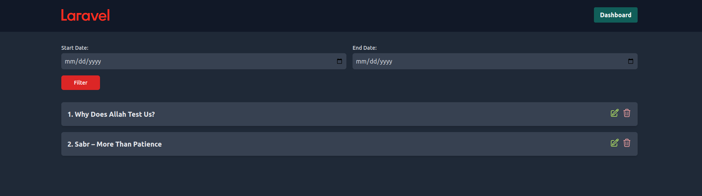

<p align="center"><a href="https://laravel.com" target="_blank"></a></p>

<p align="center">
<a href="https://github.com/laravel/framework/actions"></a>
<a href="https://packagist.org/packages/laravel/framework"></a>
<a href="https://packagist.org/packages/laravel/framework"></a>
<a href="https://packagist.org/packages/laravel/framework"></a>
</p>

## Project Description

This Laravel-based web application provides users with the ability to create profiles, log in, and interact with a dashboard for posting text content along with images. The dashboard offers features for editing, deleting, and activating/inactivating posts. Users can also filter data based on dates from their dashboard. The home route displays all users' posts from the present date, with filtering options available for both date and user. The system is designed to handle large volumes of data efficiently.



## Framework

The project is built using the PHP Laravel framework.

## Installation and Setup

### Prerequisites
- PHP (recommended version >= 8.2)
- Composer (dependency manager for PHP)
- MySQL or any other compatible database server
- Web server like Apache or Nginx

### Installation Steps
1. **Clone the Repository**: Open your terminal or command prompt and run the following command to clone the repository:

   ```
   git clone https://github.com/hr-sobuj/laravel-crud
   ```

2. **Navigate to the Project Directory**: Move into the project directory using the `cd` command:

   ```
   cd laravel-crud
   ```

3. **Install Dependencies**: Use Composer to install the project dependencies. Run the following command:

   ```
   composer install
   ```

4. **Copy Environment File**: Make a copy of the `.env.example` file and name it `.env`:

   ```
   cp .env.example .env
   ```

5. **Generate Application Key**: Run the following command to generate a unique application key:

   ```
   php artisan key:generate
   ```

6. **Configure Environment Variables**: Open the `.env` file and configure the database connection settings according to your environment. Update the following variables with your database credentials:

   ```
   DB_CONNECTION=mysql
   DB_HOST=127.0.0.1
   DB_PORT=3306
   DB_DATABASE=your_database_name
   DB_USERNAME=your_database_username
   DB_PASSWORD=your_database_password
   ```

7. **Run Migrations**: Now, migrate the database using the following command. This will create the necessary tables in your configured database:

   ```
   php artisan migrate
   ```

8. **Start the Development Server**: You can use the following command to start the development server:

   ```
   php artisan serve
   ```

   This will start a development server at `http://127.0.0.1:8000`.

9. **Access the Application**: Open your web browser and navigate to `http://127.0.0.1:8000` to access the application.

### Additional Configuration
- If you encounter any issues, make sure your environment meets Laravel's [system requirements](https://laravel.com/docs/8.x/installation#server-requirements).
- You may need to configure your web server to serve the Laravel application. Instructions for this can be found in the Laravel documentation under [web server configuration](https://laravel.com/docs/8.x/installation#web-server-configuration).

With these steps, you should be able to install and run the Laravel application successfully. Let me know if you need further assistance!

## Contributing

Thank you for considering contributing to the Laravel framework! The contribution guide can be found in the [Laravel documentation](https://laravel.com/docs/contributions).

## Code of Conduct

In order to ensure that the Laravel community is welcoming to all, please review and abide by the [Code of Conduct](https://laravel.com/docs/contributions#code-of-conduct).

## Security Vulnerabilities

If you discover a security vulnerability within Laravel, please send an e-mail to Taylor Otwell via [taylor@laravel.com](mailto:taylor@laravel.com). All security vulnerabilities will be promptly addressed.

## License

The Laravel framework is open-sourced software licensed under the [MIT license](https://opensource.org/licenses/MIT).
